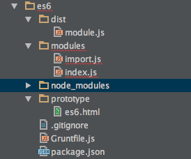

# ES6 Travel

#创建es6项目
在项目中应用es6的方法有很多种，这里选用了babel+broswerify+grunt的方法。其它方法也会在后面提到。
##babel+broswerify

我们先看一下项目结构



其中，modules文件夹下包括用ES6编写的所有模块，dist文件夹下包含编译和打包后的ES5文件。
####首先，创建package.json文件
```
npm init
```

一路回车，生成package.json.然后我们再写上依赖。
```json
{
	"devDependencies": {
	    "grunt": "^0.4.5",
	    "babelify": "^6.1.0",
	    "grunt-browserify": "^3.8.0",
	    "grunt-contrib-watch": "^0.6.1"
	  }
  }
```
  
以上就是我们项目中要用到的

- Grunt ：JavaScript任务构建工具
- babelify ：Browserify的babel转换器
- grunt-browserify ：Grunt browserify任务
- grunt-contrib-watch ：监听JavaScript的改变选择性的执行任务

```
npm install
```
安装依赖，生成node_modules文件
####创建Gruntfile文件
不熟悉grunt的，可以先移步[grunt](http://gruntjs.com/)

文件内容如下：

```
module.exports = function (grunt) {
   grunt.initConfig({
      browserify: {
         dist: {
            options: {
               transform: [
                  ["babelify", {
                     loose: "all"
                  }]
               ]
            },
            files: {
               // if the source file has an extension of es6 then
               // we change the name of the source file accordingly.
               // The result file's extension is always .js
               "./dist/module.js": ["./modules/index.js"]
            }
         }
      },
      watch: {
         scripts: {
            files: ["./modules/*.js"],
            tasks: ["browserify"]
         }
      }
   });

   grunt.loadNpmTasks("grunt-browserify");
   grunt.loadNpmTasks("grunt-contrib-watch");

   grunt.registerTask("default", ["watch"]);
   grunt.registerTask("build", ["browserify"]);
};
```
以上，我们定义了两个任务

1. grunt default/grunt：当我们在项目根目录运行这个命令，这个任务会监听modules文件夹下所有JS文件的变化。当检测到任何变化时，Grunt都会执行Browserify任务。任务终断之前，watch任务会一直运行。Ctrl+C来终断任务。
2. grunt build：Browserify任务运行一次后停止。

####写点es6
在我们的demo里我们将在modules文件夹下创建两个文件，index.js和import.js，前面一个文件是项目的主文件，后一个文件作为一个模块提供了所有的函数和变量。也就是说，index.js会从import.js中导入（import）所有的函数和变量。使用es6的新特性，import和export
其中，import内容如下：

```
let sum = (a, b = 6) => (a + b);
let square = (b) => {
    return b * b;
};
let variable = 8;

class MyClass {
    constructor(credentials) {
        this.name = credentials.name;
        this.enrollmentNo = credentials.enrollmentNo
    }
    getName() {
        return this.name;
    }
}

export { sum, square, variable, MyClass };
```

import.js作为一个模块，对外提供了一个变量、一个类和函数表达式。模块中定义的函数和变量对外是不可见的，除非显式的导出（export）他们。你可以使用export关键字。在import.js的最后一行，我们导出了sum、square、variable、MyClass。

index.js内容如下：

```
import {sum, square, variable, MyClass} from './import';

console.log(square(5));// 25

var cred = {
    name: 'Ritesh Kumar',
    enrollmentNo: 11115078
}
var x = new MyClass(cred);

console.log(x.getName());//Ritesh Kumar
```

在index.js文件中，我们使用import关键字导入import.js中对外可见内容，index.js成为了项目的主文件。
如果我们想导入一个es6扩展名的模块，那么我们必须在import中写完整的文件名。看下面的例子：

```
// if file extension of the importing file is .js
// both below mentioned methods work
import { sum, square, variable, MyClass } from './import';
import { sum, square, variable, MyClass } from './import.js'

//if file extension of the importing file is .es6
// its mandatory to add the extension
import { sum, square, variable, MyClass } from './import.es6';
```

假如我们正在使用Browserify，我们依然可以使用require()方法导入符合CommonJS规范的模块。例如：我们想使用导入jQuery作为一个模块，可以这样：

```
var $ = require('path/to/jquery');
$(window).click(function(){
    //do something
});
```
####运行es6代码
ES6的import、export结合require方法使得我们可以自由的用模块来组织我们的客户端代码，同时又可以使用新版本的JavaScript书写我们的代码。
在终端运行grunt命令：

```
grunt //或者
grunt build
```

- Browserify把所有的文件打包成一个JavaScript文件
- 打包后的文件通过Babelify转换成为ES5代码
- 生成一个名为module.js的文件，可以运行在所有的现在浏览器上，包括IE9

最后，在prototype下的html文件中引入module.js，代码就可以运行在浏览器了。
##其他环境运行ES6
关于在线运行，命令行运行，服务器运行，浏览器运行的方法，[ECMAScript6简介](http://es6.ruanyifeng.com/#docs/intro)这篇文章已经讲的很详细了，这里面介绍了许多快捷的方法，请根据需要决定使用哪一种，这里不再赘述。
##FIS3+fis-parser-babel2
fis3推出了插件来支持babel,所以我们可以通过这个来创建项目。
具体步骤请参见以下文章自行探索。（由于电脑缺少环境，fis未成功安装，所以未能给出demo）

1. [FIS项目构建](http://fis.baidu.com/fis3/docs/beginning/release.html)
2. [FIS-es6 demo](https://github.com/fex-team/fis3-demo/tree/master/use-es6)
3. [参考](http://yanhaijing.com/javascript/2015/09/04/try-es2015/)

---
#ES6新特性
- [let和const命令](#let和const)
- [变量的解构赋值](#量的解构赋值变)
- 字符串的扩展
- [正则的扩展](#正则的扩展)
- 数值的扩展
- 数组的扩展
- [函数的扩展](#函数的扩展)
- [对象的扩展](#对象的扩展)
- [Symbol](#Symbol)
- [Proxy和Reflect](#Proxy和Reflect)
- 二进制数组
- Set和Map数据结构
- Iterator和for...of循环
- Generator函数
- Promise对象
- 异步操作和Async函数
- Class
- Decorator
- Module

##let和const
###let
我们都知道，在ES5中，没有块级作用域，代之以函数作用域，函数作用域的定义为：变量在声明它们的函数体内以及这个函数体嵌套的任意函数体内都是有定义的。也就是说在函数内声明的所有变量在函数体内始终是可见的。这意味着变量在函数体内始终是可见的。即变量声明提前。这样，在ES5中我们经常会看到下列情形：

```	
var scope = "global";
function f(){
	console.log(scope);//undefined
	var scope = "local";
	console.log(scope);//local
}
```
除了函数作用域，ES5中还有全局作用域，在函数内部，局部变量的优先级高于同名的全局变量。

```
var scope = "global";
function f(){
	var scope = "local";
	return scope;
}
f();//local
```
还有下面常见情况：

```
var s = 'hello';
for (var i = 0; i < s.length; i++){
  console.log(s[i]);
}
console.log(i); // 5
```
以上，其实并不是很合理。所以ES6引入了let来改善这些情况。
####1. let提供了块级作用域
```
for(let i = 0; i < arr.length; i++){}
console.log(i)
//ReferenceError: i is not defined

function f1() {
  let n = 1;
  if (true) {
    let n = 110;
  }
  console.log(n); // 1
}

var es = [];
for (var i = 0; i < 10; i++) {
  let c = i;
  es[i] = function () {
    console.log("Upcoming edition of ECMAScript is ES" + c);
  };
}
es[6](); // Upcoming edition of ECMAScript is ES6
```
块级作用域的出现，实际上使得获得广泛应用的立即执行匿名函数（IIFE）不再必要了。

```
// IIFE写法
(function () {
  var tmp = ...;
  ...
}());

// 块级作用域写法
{
  let tmp = ...;
  ...
}
```
ES6还规定，函数本身的作用域，在其所在的块级作用域之内。

```
function f() { console.log('I am outside!'); }
(function () {
  if(false) {
    // 重复声明一次函数f
    function f() { console.log('I am inside!'); }
  }

  f();
}());
```
上面代码在ES5中运行，会得到“I am inside!”，但是在ES6中运行，会得到“I am outside!”。这是因为ES5存在函数提升，不管会不会进入if代码块，函数声明都会提升到当前作用域的顶部，得到执行；而ES6支持块级作用域，不管会不会进入if代码块，其内部声明的函数皆不会影响到作用域的外部。

```
{
  let a = 'secret';
  function f() {
    return a;
  }
}
f() // 报错
```
上面代码中，块级作用域外部，无法调用块级作用域内部定义的函数。如果确实需要调用，就要像下面这样处理。

```
let f;
{
  let a = 'secret';
  f = function () {
    return a;
  }
}
f() // "secret"
```
需要注意的是，如果在严格模式下，函数只能在顶层作用域和函数内声明，其他情况（比如if代码块、循环代码块）的声明都会报错。
####2. let不存在变量提升（hoisting）
```
console.log(foo); // ReferenceError
let foo = 123;
```
我们再看下面代码：

```
var tmp = 123;

if (true) {
  tmp = 'abc'; // ReferenceError
  let tmp;
}
```
上面代码中，存在全局变量tmp，但是块级作用域内let又声明了一个局部变量tmp，导致后者绑定这个块级作用域，所以在let声明变量前，对tmp赋值会报错。

ES6明确规定，如果区块中存在let和const命令，这个区块对这些命令声明的变量，从一开始就形成了封闭作用域。凡是在声明之前就使用这些命令，就会报错。

总之，在代码块内，使用let命令声明变量之前，该变量都是不可用的。这在语法上，称为“暂时性死区”（temporal dead zone，简称TDZ）。

```
if (true) {
  // TDZ开始
  tmp = 'abc'; // ReferenceError
  console.log(tmp); // ReferenceError

  let tmp; // TDZ结束
  console.log(tmp); // undefined

  tmp = 123;
  console.log(tmp); // 123
}
```
ES6规定暂时性死区和不存在变量提升，主要是为了减少运行时错误，防止在变量声明前就使用这个变量，从而导致意料之外的行为。这样的错误在ES5是很常见的，现在有了这种规定，避免此类错误就很容易了。

总之，暂时性死区的本质就是，只要一进入当前作用域，所要使用的变量就已经存在了，但是不可获取，只有等到声明变量的那一行代码出现，才可以获取和使用该变量。
####不能重复声明变量
```
// 报错
function () {
  let a = 10;
  var a = 1;
}

// 报错
function () {
  let a = 10;
  let a = 1;
}

// 报错
function func(arg) {
  let arg; 
}

// 不报错
function func(arg) {
  {
    let arg; 
  }
}
```
####全局对象的属性
全局对象是最顶层的对象，在浏览器环境指的是window对象，在Node.js指的是global对象。在JavaScript语言中，所有全局变量都是全局对象的属性。（Node的情况比较特殊，这一条只对REPL环境适用，模块环境必须显式声明成global的属性。）

ES6规定，var命令和function命令声明的全局变量，属于全局对象的属性；let命令、const命令、class命令声明的全局变量，不属于全局对象的属性。

```
var a = 1;
// 如果在Node的REPL环境，可以写成global.a
// 或者采用通用方法，写成this.a
window.a // 1

let b = 1;
window.b // undefined
```

上面代码中，全局变量a由var命令声明，所以它是全局对象的属性；全局变量b由let命令声明，所以它不是全局对象的属性，返回undefined。
###const
const用来声明常量，值不可变
```
const PI = 3.1415926;
PI //3.1415926

PI = 1;
PI // 3.1415926;
```

另外，const的用法与let相同
- 作用域为块级作用域
- 没有常量声明提前
- 存在暂时性死区
- 常量不可重复声明

```
const a = [];
a.push("Hello"); // 可执行
a.length = 0;    // 可执行
a = ["Dave"];    // 报错
```
上面代码中，常量a是一个数组，这个数组本身是可写的，但是如果将另一个数组赋值给a，就会报错。常量a储存的是一个地址，这个地址指向一个对象。不可变的只是这个地址，即不能把a指向另一个地址，但对象本身是可变的，所以依然可以为其添加元素。

---
##变量的解构赋值
ES6提供一种模式匹配的方法，从数组和变量中提取值，对变量赋值，叫做解构赋值
###数组的解构赋值

```
var [a, b ,c] = ["gan", "xiaoma", "yanxi"];
let [,,m] = ["yifei", "zhongshu", "gan"];
m //"gan"
const[pi, r] = [3.14, 2];
var [bar, foo] = [1];
bar //1
foo //undefined
```
如果等号两边模式不同，则解构会失败

```
// 报错
let [foo] = 1;
let [foo] = false;
let [foo] = NaN;
let [foo] = undefined;
let [foo] = null;
```
解构允许指定默认值

```
[x, y='b'] = ['a'] // x='a', y='b'
[x, y=2] = [1, undefined] // x=1, y=2
```
注意，ES6内部使用严格相等运算符（===），判断一个位置是否有值。所以，如果一个数组成员不严格等于undefined，默认值是不会生效的。

```
var [x = 1] = [undefined];
x // 1

var [x = 1] = [null];
x // null
```
上面代码中，如果一个数组成员是null，默认值就不会生效，因为null不严格等于undefined。
###对象的解构赋值

```
function equinox2() {
  return {
    date: 20,
    month: "March",
    year: 2013,
    time: {
      hour: 11, // nested
      minute: 2
    }
  };
}
 
var { date: d, month: m, time : { hour: h} } = equinox2();
// h has the value of the nested property while "year" and "minute" are skipped totally
 
console.log("This year's equinox was on " + d + m + " at " + h); // This year's equinox was on 20March at 11

```
对象的解构与数组有一个重要的不同。数组的元素是按次序排列的，变量的取值由它的位置决定；而对象的属性没有次序，变量必须与属性同名，才能取到正确的值。

```
var { bar, foo } = { foo: "aaa", bar: "bbb" };
foo // "aaa"
bar // "bbb"

var { baz } = { foo: "aaa", bar: "bbb" };
baz // undefined
```
对象的解构也可以指定默认值。

```
var {x = 3} = {};
x // 3

var {x, y = 5} = {x: 1};
console.log(x, y) // 1, 5

var { message: msg = "Something went wrong" } = {};
console.log(msg); // "Something went wrong"
```

对象的解构赋值，可以很方便地将现有对象的方法，赋值到某个变量。

```
let { log, sin, cos } = Math;
```
上面代码将Math对象的对数、正弦、余弦三个方法，赋值到对应的变量上，使用起来就会方便很多。
###字符串的解构赋值
```
var [a, b, c, d, e] = "misok";
let {length: len} = "misok" 
len  //5
```
上面第二个例子是用类数组对象的length属性赋值。
###函数参数的解构赋值
函数参数不仅可以使用解构，解构时也可用默认值

```
function move({x = 0, y = 0} = {}) {
  return [x, y];
}

move({x: 3, y: 8}); // [3, 8]
move({x: 3}); // [3, 0]
move({}); // [0, 0]
move(); // [0, 0]
```
###解构赋值的用途
- 交换变量的值
- 从函数返回多个值
- 函数参数定义
- 提取JSON数据
- 函数参数的默认值
- 遍历Map结构
- 输入模块的指定方法

##正则的扩展

##构造函数的修改
以前的构造函数只支持`字符串`

```javascript
  var regex = new RegExp('xyz','i');
  var regex = /xyz/i;
```

现在的接受`正则表达式`作为参数，就是传入正则表达式的拷贝。

如果有第二个参数的话，则将会覆盖`原修饰符`，如果没有的话，则使用传入的表达式的修饰符。

```javascript
  var regex = new RegExp(/xyz/ig,'g');
  console.log(regex.flags);//g
```

##新的修饰符
###u修饰符
`unicode模式`

用来正确处理大于\uFFFF的Unicode字符。也就是说，会正确处理四个字节的UTF-16编码。
ECMAscript正则表达式支持就不够细致
一直的就不支持4个字节的UTF-16

- '啊'的是\u554a，’啊’.length //1
- ‘𠮷’就是\ud842\udfb7，’𠮷’.length //2

```javascript
  /^\uD83D/.test('\uD83D\uDC2A')
  // true
  /^\uD83D/u.test('\uD83D\uDC2A')
  //false
  //es5不支持4个字节的UTF-16，会将齐识别为两个字符
```
####.字符
- 正则里面是匹配除了换行符以外的任意字符。
- es5不包括码点大于0xFFFF的Unicode字符，加上了u才能识别

```javascript
  var s = "𠮷";
  console.log(/^.$/.test(s)); //false
  console.log(/^.$/u.test(s)); //true
```

不添加u字符的话，上面的字符串就会被当成两个字符从而匹配失败

  ‘𠮷’实际上就是这个\ud842\udfb7

####uincode字符表示法

```javascipt
  /\u{61}/.test('a') // false
  //简单的61次u
  /\u{61}/u.test('a') // true
  //识别为u0061
  /\u{20BB7}/u.test('𠮷') // true
  //想写超过四位的只能这么表示
```

如果想使用这种大括号的形式来表示unicode字符

- 前面需要加上\u之外
- 还需要加上u修饰符

####量词

```javascript
  /a{2}/.test('aa') // true
  /a{2}/u.test('aa') // true
  /𠮷{2}/.test('𠮷𠮷') // false
  //  /\ud842\udfb7{2}/.test('\ud842\udfb7\ud842\udfb7’);
  /𠮷{2}/u.test('𠮷𠮷') // true
```

也就是下面的情况是可以的
console.log(/𠮷{2}/.test('\ud842\udfb7\udfb7')); //true

####预定义模式

```javascript
  /^\S$/.test('𠮷') // false
  /^\S$/u.test('𠮷') // true
```

\S能够识别非空白字符，然后通过u修饰符可以正确地将两位的UTF-16识别为一位，故而匹配了
与此相同的还有\D(非数字),\W

    \w在正则中可以识别`汉字`，但是ECMA的正则实现不全面，不能匹配汉字。

####i修饰符
如果想识别非规范的字符，必须得加上u

```javascript
  /[a-z]/i.test('\u212A') // false
  /[a-z]/iu.test('\u212A') // true
```

###y修饰符
“粘连”（sticky）修饰符，表现与`g修饰符`很像，g只要剩下的存在匹配就行，但是y要求必须从剩下的第一位开始匹配
  
  注意第一次也必须从lastindex匹配，也就是默认的0开始
  
```javascript
  var s = "aaa_aa_a";
  var r1 = /a+/g;
  console.log(r1.exec(s));
  console.log(r1.exec(s));
  var r2 = /a+/y;
  console.log(r2.exec(s));
  console.log(r2.exec(s));
```

    babel，traceur几个转换器暂未支持，还是firefox给力

###sticky属性
与y修饰符相匹配，这个表示是否设置了y

###flags属性
会返回正则表达式的修饰符
就和source属性会返回表达式的正文一样

```javascript
  // 返回正则表达式的修饰符
  /abc/ig.flags
  // 'gi'
  /abc/ig.sources
  //abc
```

###字符串的正则方法
字符串对象使用正则表达式的四个方法:
match，replace，search，split

ES6在语言的内部改为了使用RegExp的实例方法
    
    所有与正则相关的方法，都定义到了RegExp对象上

###RegExp.escape
静态方法是来将字符串转义成正则模式的。
并没有成为6或者7的官方方法，只是有这个需求。
  
  就是将一些保留字符进行转义
>>>>>>> c25fcf0af4838ab9438dc31671e334287ce77f33

## 函数的扩展
### 函数参数的默认值
```
let functionExt = {}；
```
#### 定义了默认值的参数，必须是函数的尾部参数，其后不能再有其他无默认值的参。
```
functionExt.paramOne = function(x = 2, y) { //报错
    return x + y;
}
```
正确写法是:
```
functionExt.paramOne = function(x, y = 2) {
    return x + y;
}
functionExt.paramOne(1); //3
```
#### 如果传入undefined，将触发该参数等于默认值，null则没有这个效果。
```
functionExt.paramTwo = function(x = 1, y = 2) {
    console.log('x:' + x + ',y:' + y);
};
functionExt.paramTwo(undefined,null); //x:1,y:null
```
#### 指定了默认值以后，函数的length属性，将返回没有指定默认值的参数个数。也就是说，指定了默认值后，length属性将失真。
```
console.log(functionExt.paramOne.length); //1
console.log(functionExt.paramTwo.length); //0
```
#### 利用参数默认值，可以指定某一个参数不得省略，如果省略就抛出一个错误。
```
functionExt.paramException = function(mustBeProvided = function() {
    throw new Error('Missing parameter~~');
}()){
    return mustBeProvided;
};
functionExt.paramException(); // Error('Missing parameter~~')
```
#### 参数默认值所处的作用域，不是全局作用域，而是函数作用域。
```
var x = 3, y = 3;
functionExt.paramTwo = function(x = 1, y = 2) {
    console.log('x:' + x + ',y:' + y);
}
functionExt.paramTwo(); //x:1,y:2
```
注：参数变量是默认声明的，所以不能用let或const再次声明。


#### [参数默认值可以与解构赋值，联合起来使用。](#函数参数的解构赋值)

### rest参数
rest参数中的变量代表一个数组，用于获取函数的多余参数，这样就不需要使用arguments对象了。rest参数搭配的变量是一个数组，该变量将多余的参数放入数组中。
#### rest参数之后不能再有其他参数（即只能是最后一个参数），否则会报错。
```
functionExt.rest = function(param1,...values) {
    values.forEach(function(value) {
        console.log(value);
    });
};
functionExt.rest(1,2,3); //2 3
```
#### 函数的length属性，不包括rest参数。
```
console.log(functionExt.rest.length); //1
```
### 扩展运算符...
扩展运算符（spread）是三个点（...）。它好比rest参数的逆运算，将一个数组转为用逗号分隔的参数序列。该运算符主要用于函数调用。
```
functionExt.spread = function(argsArry) {
    function sum(x, y, z){
       return x + y + z;
    }
    return sum(...argsArry);
};
console.log(functionExt.spread([2,3,4])); //9
```
####扩展运算符原理
扩展运算符内部调用的是数据结构的Iterator接口，因此只要具有Iterator接口的对象，都可以使用扩展运算符，比如Map结构。Generator函数运行后，返回一个遍历器对象，因此也可以使用扩展运算符。
```
var go = function*(){
  yield 1;
  yield 2;
  yield 3;
};

[...go()] // [1, 2, 3]
```
任何类似数组的对象，都可以用扩展运算符转为真正的数组。

####扩展运算符常用场景
扩展运算符可简化不能数组传值的场景，如apply和Max.math等。
ES5写法中，push方法的参数不能是数组，所以只好通过apply方法变通使用push方法。有了扩展运算符，就可以直接将数组传入push方法。
```
functionExt.spreadPush = function(argsArry_s,argsArry_d){
    argsArry_d.push(...argsArry_s);
    return [...argsArry_d];
}
var arry1 = [1,2,3];
var arry2 = [4,5,6];
console.log(functionExt.spreadPush(arry1,arry2)); //[4, 5, 6, 1, 2, 3]
```
扩展运算符可以让函数返回多个值，还可以将字符串转为真正的数组。
```
console.log([..."hello"]); //["hello"]
```
扩展运算符也可以与解构赋值结合起来，用于生成数组。
```
const [first, ...rest] = [];
first // undefined
rest  // []:
```
如果将扩展运算符用于数组赋值，只能放在参数的最后一位，否则会报错。

### name属性
函数的name属性，返回该函数的函数名。对象方法也是函数，因此也有name属性。

####ES5和ES6区别
匿名函数赋值给一个变量，ES5的name属性，会返回空字符串，而ES6的name属性会返回实际的函数名；如果将一个具名函数赋值给一个变量，则ES5和ES6的name属性都返回这个具名函数原本的名字。
```
functionExt.nameFunction = function() {}
console.log(functionExt.nameFunction); //ES5中为'',ES6中为'nameFunction'
```
####只有具名函数才有name这个属性，匿名函数是没有的。
```
'name' in (function () {}) // false
'name' in (() => {} // false
```
### 箭头函数
箭头函数是定义函数的简洁方式。
```
functionExt.arrowParam = a => console.log(a );
functionExt.arrowParam(1); //1
```
左边为函数传入的参数，右边为方法的具体内容。

####使用方法
如果箭头函数不需要参数或需要多个参数，就使用一个圆括号代表参数部分。
```
functionExt.arrowParams = (a, b) => console.log(a + b);
functionExt.arrowParams(1,2); //3
```
如果箭头函数的代码块部分多于一条语句，就要使用大括号将它们括起来，并且使用return语句返回；由于大括号被解释为代码块，所以如果箭头函数直接返回一个对象，必须在对象外面加上括号。
```
functionExt.arrowParams = (a, b) => {return a + b;};
```
等同于：
```
functionExt.arrowParams = (a, b) => a + b;
```
```
functionExt.arrowParamsObject  = (a, b) => ({a, b});
console.log(functionExt.arrowParamsObject(1,2)); //{a: 1, b: 2}
```
箭头函数的一个用处是简化回调函数。
```
// 正常函数写法
[1,2,3].map(function (x) {
  return x * x;
});
// 箭头函数写法
[1,2,3].map(x => x * x);
```

####注意点:
函数体内的this对象，绑定定义时所在的对象，而不是使用时所在的对象。
不可以当作构造函数，也就是说，不可以使用new命令，否则会抛出一个错误。
不可以使用arguments对象，该对象在函数体内不存在。如果要用，可以用Rest参数代替。
不可以使用yield命令，因此箭头函数不能用作Generator函数。


### 函数绑定
函数绑定运算符是并排的两个双冒号（::），双冒号左边是一个对象，右边是一个函数。该运算符会自动将左边的对象，作为上下文环境（即this对象），绑定到右边的函数上面。
####使用方式
如果双冒号左边为空，右边是一个对象的方法，则等于将该方法绑定在该对象上面。
```
var person = {
    name: 'ES6'
};
var sayHello = function() {
    console.log('hello,' + this.name);
};
person::sayHello(); //hello,ES6
```
由于双冒号运算符返回的还是原对象，因此可以采用链式写法。
```
var sayByebye = function() {
    console.log('byebye,' + this.name);
};
person::sayHello()::sayByebye(); //hello,ES6 byebye,ES6
```
### 尾调用优化
某个函数（实际执行）的最后一步是调用另一个函数。
####原理
函数调用会在内存形成一个“调用记录”，又称“调用帧”（call frame）,所有的调用帧，就形成一个“调用栈”（call stack）。尾调用由于是函数的最后一步操作，所以不需要保留外层函数的调用帧。
只有不再用到外层函数的内部变量，内层函数的调用帧才会取代外层函数的调用帧，否则就无法进行“尾调用优化”。
尾调用优化（Tail call optimization），即只保留内层函数的调用帧，不再用到外层函数的内部变量。


### 尾递归
函数调用自身，称为递归。如果尾调用自身，就称为尾递归。ES6明确规定，所有ECMAScript的实现，都必须部署“尾调用优化”。
####优点
尾递归来说，由于只存在一个调用帧，所以永远不会发生“栈溢出”错误。
####实现方法
尾递归的实现，往往需要改写递归函数，确保最后一步只调用自身。做到这一点的方法，就是把所有用到的内部变量改写成函数的参数。
####注意点
- 一旦使用递归，就最好使用尾递归。
- 只有开启严格模式，尾调用优化才会生效。

### 函数参数的尾逗号
ES7有一个提案，允许函数的最后一个参数有尾逗号（trailing comma）。这样为函数添加参数后，版本管理系统只会显示添加的参数所在行为更新状态。

## 对象的扩展
```
let objectExt = {};
```
###属性的简洁表示法
####ES6允许直接写入变量和函数，作为对象的属性和方法。
```
objectExt.getPerson = function() {
    var name = 'yanxi.he';
    var age = 25;
    var sayHello =  function() {
        console.log('hello');
    }
    return {name, age, sayHello};
}
objectExt.getPerson();
/* 返回一个如下的对象：
{
  age: 25,
  name: "ES6",
  sayHello: sayHello(),
  __proto__: Object
}
*/
```
####赋值器和取值器，也可以采用简洁写法。（ES5）

###属性名表达式
ES6允许字面量定义对象时，用表达式作为对象的属性名或方法名，即把表达式放在方括号内。
```
let propKey = 'name';
objectExt.book = {
    [propKey]: 'ES6',
    ['total_' + 'chapter']: 20,
    ['print_' + propKey]: function() {
        console.log(this[propKey]);
    }
};
objectExt.book['print_' + propKey](); //ES6
```
####注意点
- 属性名表达式与简洁表示法，不能同时使用，会报错。

###方法的name属性
- 如果使用了取值函数，则会在方法名前加上get。如果是存值函数，方法名的前面会加上set。
```
objectExt.nameObject = {
    fullName: function(){
        console.log('ECMAScript 6 Primer');
    },
    get getFullName(){
        return 'ECMAScript 6 Primer';
    }
};
console.log(objectExt.nameObject.fullName.name); //fullName
console.log(objectExt.nameObject.getFullName.name); //undefined
```
部分可参见函数扩展中[name属性](#name属性)
- bind方法创造的函数，name属性返回“bound”加上原函数的名字；Function构造函数创造的函数，name属性返回“anonymous”。
- 如果对象的方法是一个Symbol值，那么name属性返回的是这个Symbol值的描述。


###Object.is()
####功能
Object.is用来比较两个值是否严格相等。它与严格比较运算符（===）的行为基本一致。
```
console.log(Object.is(124,12));
```
####与比较运算符不同之处
有两个：一是+0不等于-0，二是NaN等于自身。

###Object.assign()
将源对象（source）的所有可枚举属性，复制到目标对象（target）。它至少需要两个对象作为参数，第一个参数是目标对象，后面的参数都是源对象。只要有一个参数不是对象，就会抛出TypeError错误。
```
var target = { a: 1 };
var source1 = { b: 2 };
var source2 = { c: 3 };
Object.assign(target, source1, source2);
console.log(target.b); //2
```
###注意点
- Object.assign只拷贝自身属性，不可枚举的属性（enumerable为false）和继承的属性不会被拷贝。
```

```
- 属性名为Symbol值的属性，也会被Object.assign拷贝。
```

```
- 对于嵌套的对象，Object.assign的处理方法是替换，而不是添加。
```

```
####用途
为对象添加属性、为对象添加方法、克隆对象、合并多个对象为属性指定默认值
```

```


###属性的可枚举性
ES5有三个操作会忽略enumerable为false的属性。
- for...in 循环：只遍历对象自身的和继承的可枚举的属性
- Object.keys()：返回对象自身的所有可枚举的属性的键名
- JSON.stringify()：只串行化对象自身的可枚举的属性

ES6新增了两个操作，会忽略enumerable为false的属性。
- Object.assign()：只拷贝对象自身的可枚举的属性
- Reflect.enumerate()：返回所有for...in循环会遍历的属性

###Object.observe()，Object.unobserve()
Object.observe方法用来监听对象（以及数组）的变化。一旦监听对象发生变化，就会触发回调函数。
####回调函数的changes参数是一个数组，代表对象发生的变化。下面是一个更完整的例子。
####Object.observe方法目前共支持监听六种变化。
- add：添加属性
- update：属性值的变化
- delete：删除属性
- setPrototype：设置原型
- reconfigure：属性的attributes对象发生变化
- preventExtensions：对象被禁止扩展（当一个对象变得不可扩展时，也就不必再监听了）
#### 3.Object.observe方法还可以接受第三个参数，用来指定监听的事件种类。
#### 4.Object.unobserve方法用来取消监听。

###对象的扩展运算符
- Rest参数用于从一个对象取值，相当于将所有可遍历的、但尚未被读取的属性，分配到指定的对象上面。
- Rest参数的拷贝是浅拷贝，即如果一个键的值是复合类型的值（数组、对象、函数）、那么Rest参数拷贝的是这个值的引用，而不是这个值的副本。
- Rest参数不会拷贝继承自原型对象的属性。
- 扩展运算符用于取出参数对象的所有可遍历属性，拷贝到当前对象之中。
- 如果把自定义属性放在扩展运算符前面，就变成了设置新对象的默认属性值。
- 扩展运算符的参数对象之中，如果有取值函数get，这个函数是会执行的。
- 如果扩展运算符的参数是null或undefined，这个两个值会被忽略，不会报错。

##Symbol

##Proxy和Reflect
### Proxy
Proxy可以理解成，在目标对象之前架设一层“拦截”，外界对该对象的访问，都必须先通过这层拦截，实际上重载（overload）了点运算符，即用自己的定义覆盖了语言的原始定义。ES6原生提供Proxy构造函数，用来生成Proxy实例。
####语法
```
 var proxy = new Proxy(target, handler);
```
其中new Proxy()表示生成一个Proxy实例，target参数表示所要拦截的目标对象，handler参数也是一个对象，用来定制拦截行为。
#### handler中拦截操作
-（1）get(target, propKey, receiver)
-（2）set(target, propKey, value, receiver)
-（3）has(target, propKey)
-（4）deleteProperty(target, propKey)
-（5）enumerate(target)
-（6）hasOwn(target, propKey)
-（7）ownKeys(target)
-（8）getOwnPropertyDescriptor(target, propKey)
-（9）defineProperty(target, propKey, propDesc)
-（10）preventExtensions(target)
-（11）getPrototypeOf(target)
-（12）isExtensible(target)
-（13）setPrototypeOf(target, proto)
-（14）apply(target, object, args)
-（15）construct(target, args, proxy)
####注意点

### Proxy.revocable()
Proxy.revocable方法返回一个可取消的Proxy实例。

### Reflect
将Object对象的一些明显属于语言层面的方法，放到Reflect对象上，未来的新方法将只部署在Reflect对象上。Reflect对象的方法与Proxy对象的方法一一对应，只要是Proxy对象的方法，就能在Reflect对象上找到对应的方法。
####使用方法

####方法列表
- Reflect.getOwnPropertyDescriptor(target,name)
- Reflect.defineProperty(target,name,desc)
- Reflect.getOwnPropertyNames(target)
- Reflect.getPrototypeOf(target)
- Reflect.setPrototypeOf(target, prototype)
- Reflect.deleteProperty(target,name)
- Reflect.enumerate(target)
- Reflect.freeze(target)
- Reflect.seal(target)
- Reflect.preventExtensions(target)
- Reflect.isFrozen(target)
- Reflect.isSealed(target)
- Reflect.isExtensible(target)
- Reflect.has(target,name)
- Reflect.hasOwn(target,name)
- Reflect.keys(target)
- Reflect.get(target,name,receiver)
- Reflect.set(target,name,value,receiver)
- Reflect.apply(target,thisArg,args)
- Reflect.construct(target,args)